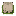
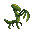

# Mativa's Adventures – Game Rules

## Introduction

You awaken... soft, squishy, and utterly alone.

You are a **slime**, lost deep within the twisting corridors of an ancient dungeon. The air is thick. The stone walls whisper secrets. But you have only one mission: **find and activate all the forgotten buttons hidden in the shadows**.

High above your head, a faint counter glows, showing the number of buttons left. Only when every button is lit will the dungeon grant you freedom.

But something lurks.

A **mantis**—not just any beast, but a tall, silent, merciless hunter. It stalks the maze, searching for the glowing buttons you've lit... and turning them off, one by one. It doesn’t know where they are. It doesn’t need to. It will find them.

Yet you have a weapon: **your lamp**. When lit, it pushes back the darkness. A warm circle of light surrounds you, revealing the path ahead—but **light is dangerous**. Light attracts.

The moment your lamp flickers to life, the mantis senses your presence. It turns. It hunts. It will not stop until you extinguish the light... or until it catches you.

There is a **delay** when you turn the light on or off. And your lamp has **limited charges**. Every use must be earned. Every glow must count.

And when (if) you manage to activate every last button... the **exit will creak open**. That’s when the mantis will lock onto you with absolute precision. No more hiding. No more searching. Only the chase.

> Run, little slime.  
> Outsmart the mantis.  
> Light the way.  
> Escape the labyrinth.

---

## 🎮 Controls

- ⬆️ ⬇️ ⬅️ ➡️ – Move the character (up, down, left, right)  
- **Spacebar** – Toggle the lamp (turn light off/on)

---

## Main Menu

At launch, you’ll arrive on the **main menu**, where you can:
- Select your character
- Choose the difficulty level
- Configure **custom game settings**

---

## Gameplay Flow

You begin in a dark maze, next to a **magical portal**. Your first mission:  
**find and activate all the hidden buttons** to unlock the exit and escape.

The number of buttons activated is shown on the **right side of the screen**.

  
*Examples of the button counter interface.*

  
*Visual cues when buttons are activated.*

---

But the task won't be easy...  
You are being **hunted** by a bloodthirsty mantis.

- The mantis **spawns** through a **green magical portal**.
- Its **position**, when in the fog of war, is marked by a **special icon**.
- If it enters your **field of view**, it reveals its true form.

The mantis reacts differently depending on your **light status**:

- **Light ON** (default): the mantis is **attracted** to your location and hunts you.
- **Light OFF**: the mantis roams the maze searching for **buttons to deactivate**, making your mission harder.

When the light is off:
- You can **attack** the mantis by surprising it in the dark—just run into it.
- This will injure the mantis, forcing it to **teleport back** to its green portal.
- When it is not actively hunting you, its icon appears **grayed out**.

  
*The mantis in various states: hidden, revealed, and vulnerable.*

However, your powers are **limited**:

- You only have a **certain number of lamp deactivations**, shown on the **left side of the screen**.
- Turning the lamp off requires **great energy**:  
  You will be **immobilized** for a short period, while the mantis continues to move.

---

## Final Challenge

Once all buttons are activated:
- The **entire maze lights up**.
- The mantis becomes **furious** and will do anything to stop you.
- The **exit portal** is now open—**reach it as fast as you can!**

  
*The exit portal close and open.*

---

## Will You Escape?

Only the clever, the brave, and the fast will survive.  
**Will you outsmart the mantis and escape the labyrinth?**
